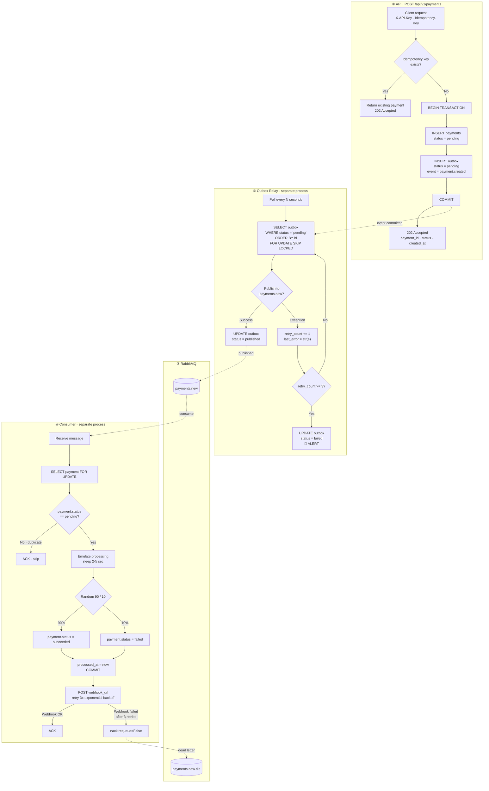

### Механика выполнения платежа OUTBOX

```mermaid
flowchart TD
    subgraph API["① API · POST /api/v1/payments"]
        A1["Client request<br/>X-API-Key · Idempotency-Key"] --> A2{"Idempotency key<br/>exists?"}
        A2 -->|Yes| A3["Return existing payment<br/>202 Accepted"]
        A2 -->|No| A4[BEGIN TRANSACTION]
        A4 --> A5["INSERT payments<br/>status = pending"]
        A5 --> A6["INSERT outbox<br/>status = pending<br/>event = payment.created"]
        A6 --> A7[COMMIT]
        A7 --> A8["202 Accepted<br/>payment_id · status · created_at"]
    end

    subgraph RELAY["② Outbox Relay · separate process"]
        R1["Poll every N seconds"] --> R2["SELECT outbox<br/>WHERE status = 'pending'<br/>ORDER BY id<br/>FOR UPDATE SKIP LOCKED"]
        R2 --> R3{"Publish to<br/>payments.new?"}
        R3 -->|Success| R4["UPDATE outbox<br/>status = published"]
        R3 -->|Exception| R5["retry_count += 1<br/>last_error = str(e)"]
        R5 --> R6{"retry_count >= 3?"}
        R6 -->|No| R2
        R6 -->|Yes| R7["UPDATE outbox<br/>status = failed<br/>🔴 ALERT"]
    end

    subgraph MQ["③ RabbitMQ"]
        Q1[("payments.new")]
        Q2[("payments.new.dlq")]
    end

    subgraph CONS["④ Consumer · separate process"]
        C1["Receive message"] --> C2["SELECT payment FOR UPDATE"]
        C2 --> C3{"payment.status<br/>== pending?"}
        C3 -->|No · duplicate| C4["ACK · skip"]
        C3 -->|Yes| C5["Emulate processing<br/>sleep 2-5 sec"]
        C5 --> C6{"Random 90 / 10"}
        C6 -->|90%| C7["payment.status = succeeded"]
        C6 -->|10%| C8["payment.status = failed"]
        C7 --> C9["processed_at = now<br/>COMMIT"]
        C8 --> C9
        C9 --> C10["POST webhook_url<br/>retry 3x exponential backoff"]
        C10 -->|Webhook OK| C11[ACK]
        C10 -->|Webhook failed<br/>after 3 retries| C12["nack requeue=False"]
    end

    A7 -.->|event committed| R2
    R4 -.->|published| Q1
    Q1 -.->|consume| C1
    C12 -.->|dead letter| Q2
```